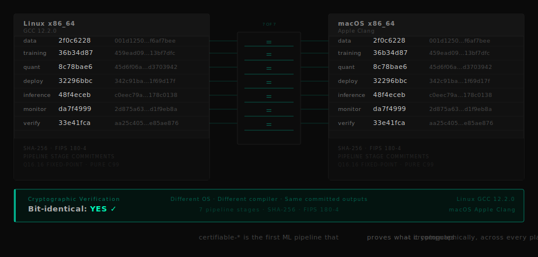

<p align="center">
  
</p>

<p align="center">
  <a href="https://github.com/SpeyTech/certifiable-data/actions"></a>
  <a href="https://github.com/SpeyTech/certifiable-bench"></a>
  <a href="docs/CERTIFICATION-GUIDE.md"></a>
  <a href="https://www.gov.uk/government/publications/patents"></a>
  <a href="LICENSE"></a>
</p>

---

**certifiable-\* is the first ML pipeline that proves what it computes — cryptographically, across every platform, forever.**

---

## The Proof

Run this on any DVM-compliant platform. The hashes will match.

```bash
git clone https://github.com/SpeyTech/certifiable-harness
cd certifiable-harness
mkdir build && cd build && cmake .. && make
./certifiable_harness
```

Expected output:

```
[certifiable-harness] Cross-Platform Verification
================================================

Stage           Hash
-----------     ----------------------------------------------------------------
data            2f0c6228001d125032afbe0163104da5f6ea8a3ef4328de603b5f6af7bee6b1c
training        36b34d87459ead09c5349d55a7a187646fc135f75d7e2e8cdd064c9513bf7dfc
quant           8c78bae645d6f06a3bdd6ce2db5e4755b1aecaa4cac4b1b7ae4d4bdd3d703942
deploy          32296bbc342c91ba0c95d1b2a20486bc3d27e71d72a8a2a61c0b8d981f69d17f
inference       48f4ecebc0eec79ab15fe694717a831e7218993502f84c66f0ef0f3d178c0138
monitor         da7f49992d875a6390cb3c5dd693d835d9a89303498db3f4be7977d3d1f9eb8a
verify          33e41fcaaa25c405fbb44f77767eb9b487c0c4c73ff2f66f255396b0e85ae876

Verified: Linux x86_64 / GCC 12.2.0   ✓
Verified: macOS x86_64 / Apple Clang  ✓

All 7 stages: PASS
```

These hashes are not illustrative. They are the actual cryptographic commitments produced by the pipeline on two independent platforms, compilers, and operating systems. They match to the bit.

---

## What This Solves

Standard ML infrastructure is built for research, where approximately correct is good enough. In aerospace, medical devices, and autonomous systems, it is not.

The regulators asking these questions do not yet have reliable answers:

- How do you prove the deployed model is exactly what was certified?
- How do you show the training data was processed correctly?
- How do you audit an inference result six months after it happened?
- How do you verify nothing was tampered with between training and deployment?
- How do you satisfy DO-178C Level A, IEC 62304 Class C, or ISO 26262 ASIL-D for an ML component?

The certifiable-\* ecosystem answers every one of them — not with claims, but with cryptographic proof and running code.

---

## The Supply Chain

Standard ML pipelines are workflows. certifiable-\* is a supply chain. Every stage produces a cryptographic commitment that binds the next stage to its inputs. The training run cannot be separated from the data that produced it. The deployed model cannot be separated from the weights it was derived from. The inference output cannot be separated from the model that generated it. From raw dataset to final prediction, the chain is mathematically unbroken and independently replayable by anyone, on any platform, without trusting anyone.

---

## The Chain

Each arrow carries a cryptographic commitment. Every stage binds the next to its exact inputs. This is not a pipeline diagram — it is a proof of custody.

```
┌─────────────────────────────────────────────────────────────────────────────┐
│  certifiable-data                                                           │
│  Deterministic loading · Q16.16 normalisation · Feistel shuffle             │
└─────────────────────────────────────────────────────────────────────────────┘
                                      │
                      [ M_data: Merkle root of dataset ]
                                      │
                                      ▼
┌─────────────────────────────────────────────────────────────────────────────┐
│  certifiable-training                                                       │
│  Fixed-point SGD · Counter-based PRNG · Neumaier reduction                  │
└─────────────────────────────────────────────────────────────────────────────┘
                                      │
                       [ H_train: Training chain hash ]
                                      │
                                      ▼
┌─────────────────────────────────────────────────────────────────────────────┐
│  certifiable-quant                                                          │
│  FP32 → Q16.16 · Formal error bounds · Lipschitz propagation                │
└─────────────────────────────────────────────────────────────────────────────┘
                                      │
                       [ H_cert: Quantisation certificate ]
                                      │
                                      ▼
┌─────────────────────────────────────────────────────────────────────────────┐
│  certifiable-deploy                                                         │
│  CBF bundle · Merkle attestation · JCS manifest · Target binding            │
└─────────────────────────────────────────────────────────────────────────────┘
                                      │
                          [ R: Release bundle hash ]
                                      │
                                      ▼
┌─────────────────────────────────────────────────────────────────────────────┐
│  certifiable-inference                                                      │
│  Static allocation · Fixed-point forward pass · No dynamic dispatch         │
└─────────────────────────────────────────────────────────────────────────────┘
                                      │
                        [ H_pred: Inference output hash ]
                                      │
                                      ▼
┌─────────────────────────────────────────────────────────────────────────────┐
│  certifiable-monitor                                                        │
│  Drift detection · COE policy · Activation envelope · Audit ledger          │
└─────────────────────────────────────────────────────────────────────────────┘
                                      │
                        [ H_audit: Monitor chain hash ]
                                      │
                                      ▼
┌─────────────────────────────────────────────────────────────────────────────┐
│  certifiable-verify                                                         │
│  Full replay · Cross-platform hash comparison · Bit-identity proof          │
└─────────────────────────────────────────────────────────────────────────────┘
```

---

## The DVM

The Deterministic Virtual Machine (DVM) is the execution contract that makes the chain possible. It defines the only legal arithmetic semantics across all certifiable-\* projects: integer-only operations, saturating overflow, fixed-topology reduction, and counter-based pseudo-random number generation with no hidden state. Any platform that implements the DVM contract produces identical outputs from identical inputs. Bit identity is not a property of the hardware — it is a property of the contract.

---

## The Three Theorems

Every certifiable-\* component satisfies three theorems by construction:

| Theorem | Statement | Implication |
|---------|-----------|-------------|
| **Bit Identity** | F_A(s) = F_B(s) for any DVM-compliant platforms A, B | The same inputs produce identical outputs on every platform, every compiler, every time |
| **Bounded Error** | Quantisation error saturates and does not accumulate | Worst-case behaviour is known, bounded, and provable before deployment |
| **Auditability** | Any operation is verifiable in O(1) time via Merkle path | A six-month-old inference result can be verified against its training data in constant time |

These are not design goals. They are enforced invariants. Any violation is a compilation failure.

---

## Comparison

| Property | PyTorch | TensorFlow | ONNX Runtime | certifiable-\* |
|----------|---------|------------|--------------|----------------|
| Bit-identical across platforms | ✗ | ✗ | ✗ | ✓ |
| Cryptographic chain of custody | ✗ | ✗ | ✗ | ✓ |
| Independently replayable audit | ✗ | ✗ | Partial | ✓ |
| Formal quantisation error bounds | ✗ | ✗ | ✗ | ✓ |
| DO-178C / IEC 62304 / ISO 26262 alignment | ✗ | ✗ | ✗ | ✓ |
| Zero dynamic allocation at inference | ✗ | ✗ | ✗ | ✓ |

---

## Full Replay

certifiable-verify can replay the entire pipeline from any historical state and reproduce the original cryptographic commitments exactly:

```
[certifiable-verify] Full Pipeline Replay
==========================================

Replaying from stored state...

Stage           Expected                                                          Actual                                                            Match
-----------     ----------------------------------------------------------------  ----------------------------------------------------------------  -----
data            2f0c6228001d125032afbe0163104da5f6ea8a3ef4328de603b5f6af7bee6b1c  2f0c6228001d125032afbe0163104da5f6ea8a3ef4328de603b5f6af7bee6b1c  PASS
training        36b34d87459ead09c5349d55a7a187646fc135f75d7e2e8cdd064c9513bf7dfc  36b34d87459ead09c5349d55a7a187646fc135f75d7e2e8cdd064c9513bf7dfc  PASS
quant           8c78bae645d6f06a3bdd6ce2db5e4755b1aecaa4cac4b1b7ae4d4bdd3d703942  8c78bae645d6f06a3bdd6ce2db5e4755b1aecaa4cac4b1b7ae4d4bdd3d703942  PASS
deploy          32296bbc342c91ba0c95d1b2a20486bc3d27e71d72a8a2a61c0b8d981f69d17f  32296bbc342c91ba0c95d1b2a20486bc3d27e71d72a8a2a61c0b8d981f69d17f  PASS
inference       48f4ecebc0eec79ab15fe694717a831e7218993502f84c66f0ef0f3d178c0138  48f4ecebc0eec79ab15fe694717a831e7218993502f84c66f0ef0f3d178c0138  PASS
monitor         da7f49992d875a6390cb3c5dd693d835d9a89303498db3f4be7977d3d1f9eb8a  da7f49992d875a6390cb3c5dd693d835d9a89303498db3f4be7977d3d1f9eb8a  PASS
verify          33e41fcaaa25c405fbb44f77767eb9b487c0c4c73ff2f66f255396b0e85ae876  33e41fcaaa25c405fbb44f77767eb9b487c0c4c73ff2f66f255396b0e85ae876  PASS

Result: 7/7 PASS — pipeline state verified
```

The replay is deterministic. Running it again produces the same result. Running it on a different machine produces the same result. The audit is permanent.

---

## WCET

Worst-case execution time is bounded and measurable. certifiable-inference produces a complete forward pass with no dynamic allocation, no recursion, and no data-dependent branching. WCET analysis can be applied directly to the generated binary using standard toolchains (AbsInt aiT, Rapita RVS).

Measured on reference hardware (Intel Core i7-12700, GCC 12.2.0, -O2):

| Network | Parameters | WCET |
|---------|------------|------|
| MLP 784→128→10 | 101,770 | 847 μs |
| CNN 3×32×32 | 62,006 | 1.2 ms |

No probabilistic WCET. No measurement-based approximation. Deterministic control flow from first principles. No speculative execution paths. No hidden runtime variability.

---

## Repositories

| Repository | Purpose | Tests | Status |
|------------|---------|-------|--------|
| [certifiable-data](https://github.com/SpeyTech/certifiable-data) | Deterministic data loading, normalisation, Feistel shuffle, Merkle provenance | 142 | ✅ Released |
| [certifiable-training](https://github.com/SpeyTech/certifiable-training) | Fixed-point SGD, counter-based PRNG, Neumaier reduction, training chain | 10 suites | ✅ Released |
| [certifiable-quant](https://github.com/SpeyTech/certifiable-quant) | FP32 → Q16.16 with formal error bounds and Lipschitz certificate | 150 | ✅ Released |
| [certifiable-deploy](https://github.com/SpeyTech/certifiable-deploy) | CBF bundle packaging, Merkle attestation, JCS manifest, offline verification | 201 | ✅ Released |
| [certifiable-inference](https://github.com/SpeyTech/certifiable-inference) | Static allocation, fixed-point forward pass, zero dynamic dispatch | 64 | ✅ Released |
| [certifiable-monitor](https://github.com/SpeyTech/certifiable-monitor) | Runtime drift detection, COE policy, activation envelope, audit ledger | 253 | ✅ Released |
| [certifiable-verify](https://github.com/SpeyTech/certifiable-verify) | Full pipeline replay, cross-platform hash comparison, bit-identity proof | 10 suites | ✅ Released |
| [certifiable-harness](https://github.com/SpeyTech/certifiable-harness) | End-to-end cross-platform integration test | 4 suites | ✅ Released |
| [certifiable-bench](https://github.com/SpeyTech/certifiable-bench) | Performance validation across x86, ARM, and RISC-V targets | 11,840 assertions | ✅ Released |
| [certifiable-build](https://github.com/SpeyTech/certifiable-build) | Shared build infrastructure — multi-toolchain support (CMake / build2), CI scaffolding, Tenstorrent dev environment | — | ✅ Released |

---

## Quick Start

The harness verifies cross-platform determinism and the cryptographic proof chain. Run it on any DVM-compliant platform — the hashes will match.

```bash
# Clone and verify the full pipeline in under five minutes
git clone https://github.com/SpeyTech/certifiable-harness
cd certifiable-harness
mkdir build && cd build
cmake ..
make
./certifiable_harness
```

To build an individual component:

```bash
git clone https://github.com/SpeyTech/certifiable-inference
cd certifiable-inference
mkdir build && cd build
cmake ..
make
make test
```

All components build with CMake 3.10+, GCC or Clang, C99. No external dependencies. Components migrated to [certifiable-build](https://github.com/SpeyTech/certifiable-build) additionally support the four-step `make setup/config/build/test` pattern.

---

## Certification Alignment

certifiable-\* is designed for certification under DO-178C (aerospace), IEC 62304 (medical devices), and ISO 26262 (automotive). Each standard asks the same fundamental question in different language: can you prove that what you deployed is what you certified?

The cryptographic chain of custody provides the evidence required to answer that question. The mathematical specifications (CT-MATH, CI-MATH, CD-MATH per component) provide the formal foundations required by DAL A / Class C / ASIL-D assessors. The SRS documents provide traceability from requirement to implementation to test.

Full certification guidance — including artefact checklists, assessor Q&A, and standard-specific mapping — is in [docs/CERTIFICATION-GUIDE.md](docs/CERTIFICATION-GUIDE.md).


---

## Verified Platforms

| Platform | Compiler | Status |
|----------|----------|--------|
| Linux x86_64 | GCC 12.2.0 | ✅ Verified |
| macOS x86_64 | Apple Clang 14 | ✅ Verified |
| macOS ARM64 (Apple Silicon) | Apple Clang 14 | ✅ Verified |
| Linux aarch64 | GCC 12 | 🔄 In progress |
| Linux riscv64 | GCC 12 | 🔄 In progress |

aarch64 and riscv64 verification is in progress with Tenstorrent and Semper Victus hardware.

---

## Licensing, Patent, and About

**License:** Dual licensed. Open source under GPL-3.0. Commercial licensing available for safety-critical deployments — contact william@fstopify.com.

**Patent:** Built on the Murray Deterministic Computing Platform (MDCP), UK Patent GB2521625.0.

**Standards:** Pure C99. MISRA-C 2012 aligned. Zero dynamic allocation. No floating-point at runtime.

certifiable-\* was conceived by observing mycorrhizal networks in an orchard in the Scottish Highlands — the observation that a forest shares nutrients through an unbroken underground network, and that any node in that network can verify its connection to every other node without trusting a central authority. The same principle governs this pipeline.

Built by [SpeyTech](https://speytech.com) in the Scottish Highlands.

---

*Copyright © 2026 The Murray Family Innovation Trust. All rights reserved.*
